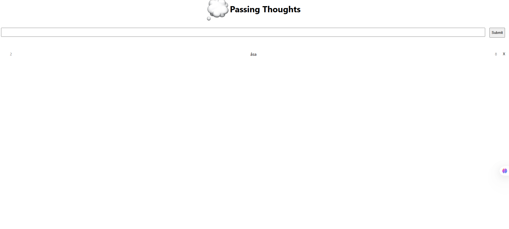

# Passing Thoughts

A simple React app where you can post short "thoughts" that disappear after a few seconds — inspired by fleeting ideas that come and go.



## 🚀 Features

* ⏳ Each thought automatically expires after a few seconds.
* 🗨️ Post new thoughts via a form input.
* ❌ Remove thoughts manually with a click.
* 🎨 Clean and minimal UI using CSS and Flexbox.

## 🛠 Getting Started

Clone the repo and install dependencies:

```bash
git clone https://github.com/your-username/passing-thoughts.git
cd passing-thoughts
npm install
```

Start the development server:

```bash
npm start
```

Open [http://localhost:3000](http://localhost:3000) in your browser.

## 🧪 Scripts

| Script          | Description                          |
| --------------- | ------------------------------------ |
| `npm start`     | Runs the app in development mode     |
| `npm run build` | Builds the app for production        |
| `npm test`      | Launches the test runner             |
| `npm run eject` | Ejects the project (not recommended) |

## 📁 Project Structure

```
passing-thoughts/
├── public/
│   ├── image.jpg
│   └── index.html
├── src/
│   ├── App.js
│   ├── Thought.js
│   ├── utils.js
│   ├── App.css
│   └── Thought.css
├── package.json
└── README.md
```

## 📚 Learn More

* [React Documentation](https://reactjs.org/)
* [Create React App Docs](https://create-react-app.dev/)

## 📦 Deployment

Build your project with:

```bash
npm run build
```

Then deploy the `build/` folder to any static hosting provider (e.g. Netlify, Vercel, GitHub Pages).

---

Feel free to contribute or customize this app for your own idea-based projects!
